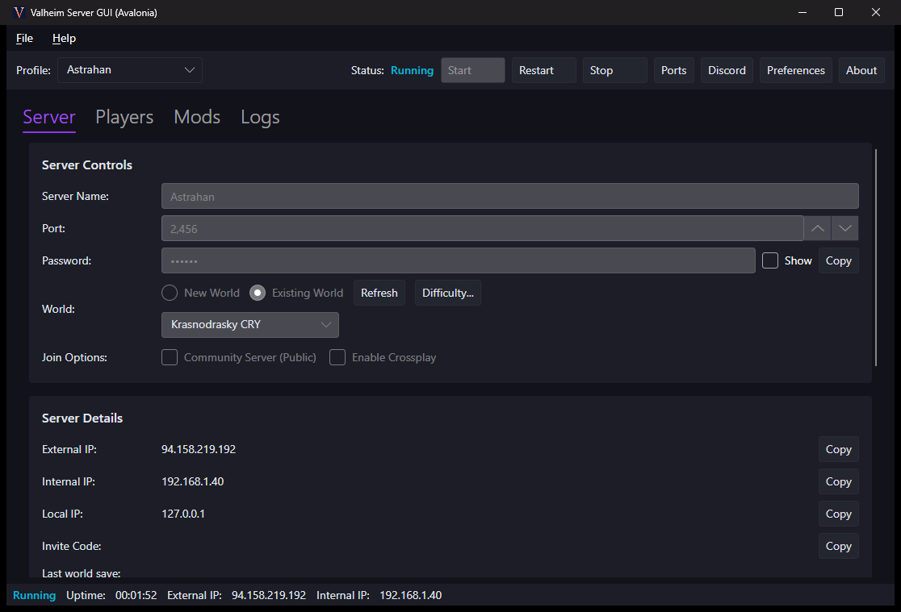
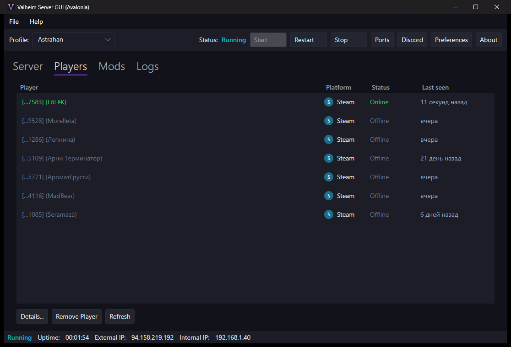
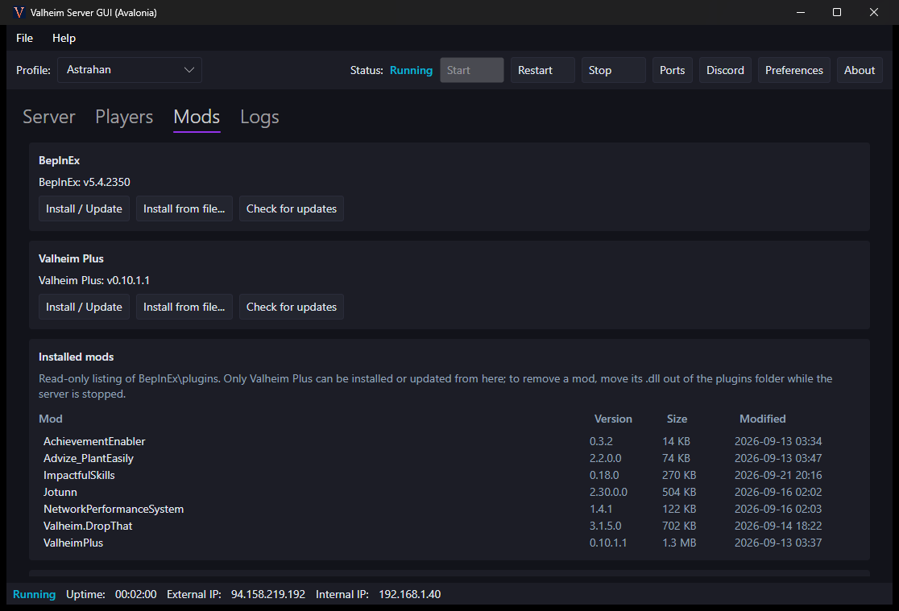
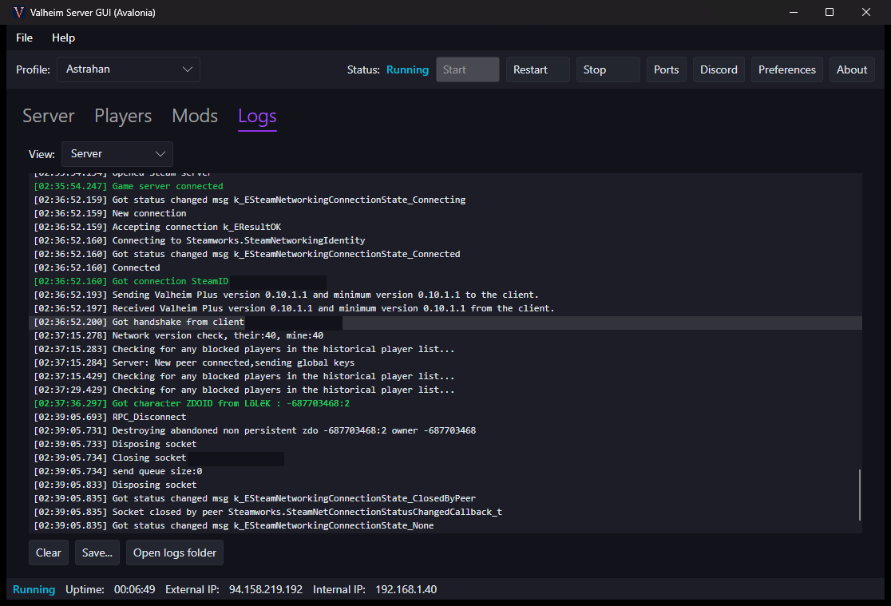

# ValheimServerGUI

English | [Русский](README.ru.md)

A simple user interface for running a [Valheim](https://www.valheimgame.com/) Dedicated Server on your Windows PC.

Download the [latest release here](https://github.com/zhoel-sherk/ValheimServerGUI/releases). It's just a single, small .exe file!

Need help? Create a [GitHub issue](https://github.com/zhoel-sherk/ValheimServerGUI/issues/new), or check out the [Online Manual](https://github.com/runeberry/ValheimServerGUI/wiki) for answers to some common questions.

**Disclaimer:** _This is a fan-made project. Runeberry Software is not affiliated with Valheim or Iron Gate Studio in any official capacity. Use at your own risk!_

<table width="100%" align="center">
  <tr>
    <td align="center"> Server</td>
    <td align="center"> Players</td>
  </tr>
  <tr>
    <td align="center"> Mods &amp; backups</td>
    <td align="center"> Logs</td>
  </tr>
</table>

## Requirements

In order to run ValheimServerGUI, you will need the following:

* **Windows 10 or 11 x64-based PC** - Other Windows configurations may or may not work. 🤷‍♀
* **.NET 10 Runtime** - If you don't have it, you should be prompted to install it when you first run this app. Otherwise, you can install the latest release [here](https://dotnet.microsoft.com/download/dotnet/10.0) (under ".NET Runtime 10.X.X").
* **Valheim Dedicated Server** - Comes free with your purchase of Valheim. See the installation guide [here](https://github.com/runeberry/ValheimServerGUI/wiki/Installing-Valheim-Dedicated-Server).

## Features

* **It remembers!** - Stores your server info between sessions, and it can't be overwritten by Steam
* **Status updates** - Clearly shows when your server is running, starting, or stopping
* **Online players** - Live players are highlighted, with a badge showing which platform they joined from and when they were last seen
* **Cross-platform support** - Recognizes players from Steam, Xbox, PlayStation and Nintendo
* **Easy IP address** - No more guessing, copy the right IP address to give to your friends straight from the app
* **Cleaner, clearer logs** - Filters out the noisy debug output and highlights the events that matter (joins, deaths, refused connections), following the tail as it streams
* **Input validation** - Prevents you from creating a server with bad info that would fail to launch
* **Safe shutdowns** - Safely stops the server when you close the app or shut down Windows
* **Automatic startup** - If enabled, can automatically start up your server when Windows starts
* **Minimize to tray** - Minimize this app and control your server entirely from the Windows system tray
* **Server profiles** - Save and switch between server configurations from the profile dropdown (one server runs at a time)
* **Difficulty presets** - Set world difficulty (Easy, Hard, Hardcore, Casual, and per-modifier or per-key control) via the "Difficulty..." dialog next to the world selector. It can restart a running server so the change takes effect
* **Works with mods!** - Tested and working with server-side mods such as [Valheim Plus](https://www.nexusmods.com/valheim/mods/2323). Install/update BepInEx and Valheim Plus from the app, list the mods present in the plugins folder, and open the plugins/config folders or a mod's config file directly
* **Steam Cloud worlds** - Worlds saved to Steam Cloud appear in the world list; import them (Move/Copy) into the server's local save folder to host them
* **Port forwarding** - Maps the three UDP ports your server needs through UPnP/NAT-PMP from a "Ports" dialog, and warns when you are behind CGNAT/double NAT
* **Discord notifications** - Optional webhook notifications for server online/offline, player join/leave/death and join-code changes

### A note on difficulty

Valheim bakes difficulty modifiers in when a *world is generated*, and the server only reads them
at launch. So raising the difficulty of an **existing** world mostly affects newly generated areas
rather than the world you already have; to change it fully, delete the world and start it again.
The dialog warns about this, and about the restart, before it changes anything.

## Roadmap

Ideas for future releases (no timelines, contributions welcome):

* **Enable/disable mods** - Turn individual mods on and off from the Mods tab
* **Install any mod** - Install and update server-side mods from Thunderstore, with dependencies resolved
* **Mod presets** - Save & apply whole mod loadouts (presets)
* **Player roles** - Make players admins, ban them, or run a permitted-only server

BepInEx + Valheim Plus install/update, a read-only list of installed mods, Steam Cloud world
import, Discord webhook notifications, UPnP/NAT-PMP port forwarding and mod folder/config actions
have shipped.

## Quick guide

1. Launch ValheimServerGUI.exe.
2. Enter your desired Server Name and Password. You don't need to change the Port in most cases.
3. Select the world you want to host, or enter a new world name.
4. Check any additional join options you want enabled:
  * **Community Server** will show your server in the server browser in-game.
  * **Enable Crossplay** will allow players on any platform to join with an Invite Code
1. Click "Start Server". When the status bar reads "Running", you're ready to play! You can copy your server's IP address or Invite Code from the Server Details tab to share with friends.

## FAQs

Why choose a dedicated server, and why use ValheimServerGUI? Find the answers on our [FAQs page](https://github.com/runeberry/ValheimServerGUI/wiki/Frequently-Asked-Questions).

## Contributing

Interested in contributing code to ValheimServerGUI? Check out the guidelines and full developer's guide [here](CONTRIBUTING.md).

## License

This project is licensed under the [GNU GPLv3](LICENSE).

It is a community fork of the original ValheimServerGUI project by [Runeberry Software](https://github.com/runeberry/ValheimServerGUI), whose original work is gratefully acknowledged. All copyright notices are preserved in accordance with the GPL.
