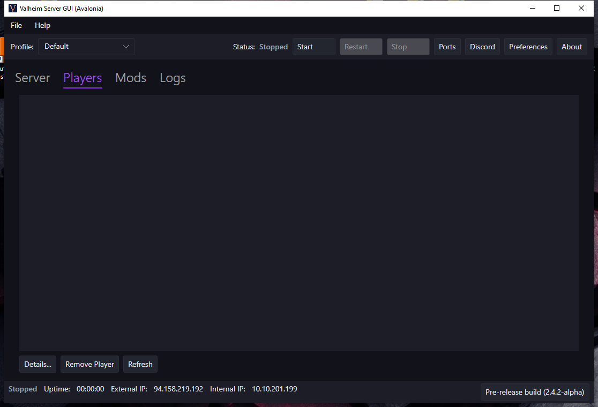

# ValheimServerGUI

[English](README.md) | Русский

Простой графический интерфейс для запуска выделенного сервера [Valheim](https://www.valheimgame.com/) на вашем ПК с Windows.

Скачать последнюю версию можно [здесь](https://github.com/zhoel-sherk/ValheimServerGUI/releases). Это один небольшой .exe файл!

Нужна помощь? Создайте [issue на GitHub](https://github.com/zhoel-sherk/ValheimServerGUI/issues/new) или посмотрите [онлайн-руководство](https://github.com/runeberry/ValheimServerGUI/wiki) с ответами на частые вопросы.

**Дисклеймер:** _Это фанатский проект. Runeberry Software никак не связана с Valheim или Iron Gate Studio. Используйте на свой страх и риск!_

<table width="100%" align="center">
  <tr>
    <td></td>
    <td></td>
  </tr>
  <tr>
    <td></td>
    <td></td>
  </tr>
</table>

## Требования

Для запуска ValheimServerGUI вам понадобится:

* **ПК на Windows 10 или 11 (x64)** - другие конфигурации Windows могут работать, а могут и нет. 🤷‍♀
* **.NET 10 Desktop Runtime** - если он у вас не установлен, вам будет предложено установить его при первом запуске. Либо скачайте последнюю версию [здесь](https://dotnet.microsoft.com/download/dotnet/10.0) (раздел ".NET Desktop Runtime 10.X.X").
* **Valheim Dedicated Server** - идёт бесплатно с покупкой Valheim. Инструкция по установке [здесь](https://github.com/runeberry/ValheimServerGUI/wiki/Installing-Valheim-Dedicated-Server).

## Возможности

* **Всё помнит!** - Хранит данные вашего сервера между сессиями, и Steam не сможет их перезаписать
* **Статусы сервера** - Наглядно показывает, когда сервер запущен, запускается или останавливается
* **Игроки онлайн** - Показывает, кто в сети, кто офлайн, когда пришёл и когда ушёл
* **Кроссплатформенность** - Распознаёт игроков со Steam и Xbox
* **Лёгкий IP-адрес** - Больше не нужно гадать: скопируйте правильный IP-адрес для друзей прямо из приложения
* **Чистые логи сервера** - Убирает большую часть отладочного шума, который выдаёт сервер
* **Проверка ввода** - Не даст создать сервер с некорректными данными, который не запустится
* **Безопасное выключение** - Аккуратно останавливает сервер при закрытии приложения или выключении Windows
* **Автозапуск** - Может автоматически запускать сервер вместе с Windows
* **Сворачивание в трей** - Сверните приложение и управляйте сервером из системного трея
* **Несколько серверов** - Запускайте несколько серверов, создавая отдельные профили (см. [FAQ](https://github.com/runeberry/ValheimServerGUI/wiki/Frequently-Asked-Questions))
* **Пресеты сложности** - Применяйте готовые пресеты сложности (Easy, Hard, Hardcore, Casual и др.) в настройках мира - иконка шестерёнки рядом с выбором мира
* **Работает с модами!** - Протестировано с серверными модами вроде [Valheim Plus](https://www.nexusmods.com/valheim/mods/2323)

## Планы (Roadmap)

Идеи для будущих релизов (без сроков, welcome к участию):

* **Поддержка BepInEx** - Установка и обновление BepInEx для выделенного сервера прямо из приложения
* **Список модов** - Просмотр и установка серверных модов
* **Конфигурация модов** - Включение/отключение установленных модов (on/off)
* **Пресеты модов** - Сохранение и применение целых наборов модов (пресеты)

## Краткое руководство

1. Запустите ValheimServerGUI.exe.
2. Введите имя сервера и пароль. Порт в большинстве случаев менять не нужно.
3. Выберите мир, который хотите хостить, или введите имя нового мира.
4. Отметьте дополнительные опции подключения, если нужно:
   * **Community Server** - сервер будет виден в списке серверов внутри игры.
   * **Enable Crossplay** - позволит игрокам с любых платформ подключаться по Invite Code.
5. Нажмите "Start Server". Когда в статусе появится "Running" - можно играть! IP-адрес сервера или Invite Code можно скопировать на вкладке Server Details и отправить друзьям.

## FAQ

Почему стоит выбрать выделенный сервер и зачем нужен ValheimServerGUI? Ответы на [странице FAQ](https://github.com/runeberry/ValheimServerGUI/wiki/Frequently-Asked-Questions) (на английском).

## Участие в проекте

Хотите помогать с кодом ValheimServerGUI? Инструкция для разработчиков - [здесь](CONTRIBUTING.md) (на английском).

## Лицензия

Проект распространяется под лицензией [GNU GPLv3](LICENSE).

Это комьюнити-форк оригинального проекта ValheimServerGUI от [Runeberry Software](https://github.com/runeberry/ValheimServerGUI) - благодарим за исходную работу. Все уведомления об авторских правах сохранены в соответствии с GPL.
